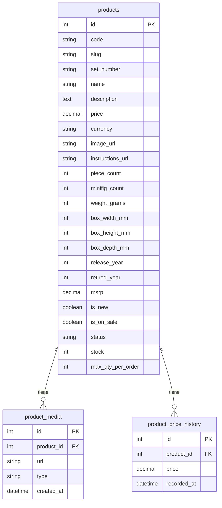

# Lego Ecommerce Monorepo

Repositorio que agrupa el backend y frontend de una tienda B2C de Lego.

Incluye autenticación OAuth (Google/Facebook) con PKCE, idempotencia para creación de
órdenes y webhooks, y configuración de seguridad HTTP con Helmet.

## Requisitos

- Node.js 18+
- npm

## Estructura del repositorio

```
├── ecommerce-backend/   # API en Node.js, Express y GraphQL
├── ecommerce-frontend/  # Aplicación web en React
├── cypress/             # Pruebas end-to-end con Cypress
└── cypress.config.js    # Configuración de Cypress
```

## Configuración

1. Clonar este repositorio.
2. Instalar dependencias en cada paquete:
   ```bash
   cd ecommerce-backend && npm install
   cd ../ecommerce-frontend && npm install
   ```

## Ejecución

- **Backend**
  ```bash
  cd ecommerce-backend
  npm run dev    # modo desarrollo
  npm start      # modo producción
  ```
- **Frontend**
  ```bash
  cd ecommerce-frontend
  npm start      # servidor de desarrollo
  npm run build  # compilación para producción
  ```
  Para auditorías de Lighthouse CI en producción:
  ```bash
  npm run build
  npm run lhci
  ```

## Pruebas

- **Backend**: `cd ecommerce-backend && npm test`
- **Frontend**: `cd ecommerce-frontend && npm test`
- **End-to-end**: con el backend y frontend ejecutándose, correr `npx cypress run`

Para más detalles de variables de entorno y estructuras internas, revisar los README de cada paquete.

## Esquema de base de datos



## API de productos

### `GET /products`

Lista productos con paginación y filtros.

**Parámetros de consulta**

- `search`: texto a buscar en nombre o descripción.
- `theme`: filtra por nombre de categoría.
- `slug`, `setNumber`.
- `minPrice`, `maxPrice`.
- `minPieces`, `maxPieces`.
- `ageMin`, `ageMax`.
- `status`, `visibility`.
- `isOnSale`, `isNew` (booleanos).
- `page`, `limit` (paginación).
- `order`: `price_asc`, `price_desc`, `msrp_asc`, `msrp_desc`, `newest`, `oldest`, `name_asc`, `name_desc`, `pieces_asc`, `pieces_desc`.

**Respuesta**

```json
{
  "total": 0,
  "page": 1,
  "limit": 10,
  "items": [
    {
      "id": 1,
      "code": "",
      "slug": "",
      "setNumber": "",
      "name": "",
      "description": "",
      "msrp": 0,
      "salePrice": 0,
      "priceEffective": 0,
      "isOnSale": false,
      "isNew": false,
      "primaryImageUrl": ""
    }
  ],
  "facets": {
    "status": {},
    "visibility": {},
    "isOnSale": {},
    "isNew": {}
  }
}
```

### `GET /products/:idOrSlug`

Obtiene el detalle de un producto por ID numérico o `slug`.

**Respuesta**

```json
{
  "id": 1,
  "code": "",
  "slug": "",
  "setNumber": "",
  "name": "",
  "description": "",
  "msrp": 0,
  "salePrice": 0,
  "priceEffective": 0,
  "isOnSale": false,
  "isNew": false,
  "primaryImageUrl": "",
  "categories": [],
  "reviews": []
}
```

## Reglas de negocio

- **Ventanas de precio**: cada modificación de precio se registra en `product_price_history` con `recorded_at`, permitiendo analizar periodos de vigencia. El precio efectivo corresponde al último registro; si `salePrice` es menor a `msrp`, el producto está en oferta.
- **Límites de cantidad**: el campo `max_qty_per_order` en `products` establece cuántas unidades se pueden comprar por pedido. Las operaciones de carrito respetan este límite.

## Variables de entorno

- `DEFAULT_CURRENCY`: moneda por defecto para nuevos precios.
- `ASSET_BASE_URL`: URL base para medios e imágenes de productos.
- `NEWNESS_WINDOW_DAYS`: días que un producto se considera nuevo desde su `release_year`.
- `DEFAULT_TAX_CLASS`: clase de impuesto aplicada por defecto a los productos.
