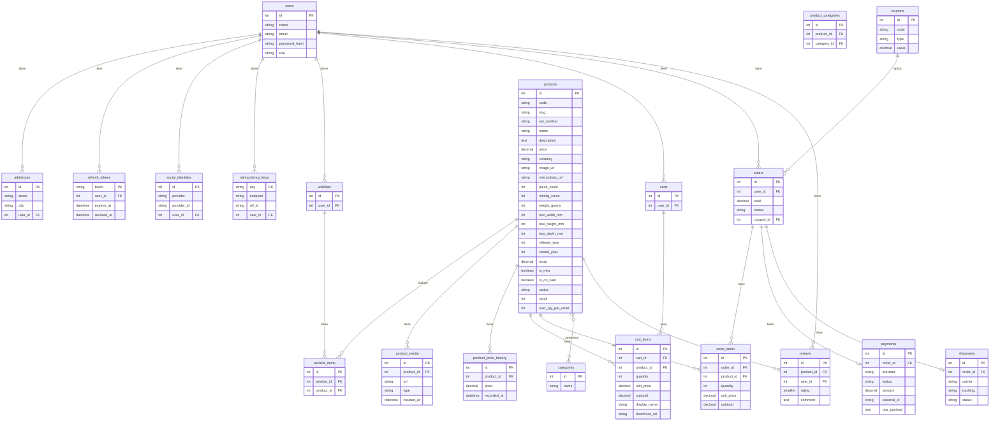

# Lego Ecommerce Backend

Service de backend para una tienda B2C de Lego construido con Node.js, Express y GraphQL.

## Requisitos

- Node.js 18+
- npm

## Instalación

1. Instalar dependencias:
   ```bash
   npm install
   ```
2. Crear un archivo `.env` en la raíz del proyecto con las variables necesarias. Ejemplo:
   ```env
   PORT=3000
   BASE_URL=http://localhost:3000
   DB_URI=sqlite::memory:
   JWT_SECRET=cambia_este_secreto
   GOOGLE_CLIENT_ID=
   GOOGLE_CLIENT_SECRET=
   FACEBOOK_APP_ID=
   FACEBOOK_APP_SECRET=
   MP_ACCESS_TOKEN=
   CLOUDINARY_CLOUD_NAME=
   CLOUDINARY_API_KEY=
   CLOUDINARY_API_SECRET=
   DEFAULT_CURRENCY=USD
   ASSET_BASE_URL=http://localhost:3000/assets
   NEWNESS_WINDOW_DAYS=30
   DEFAULT_TAX_CLASS=standard
   ```
   Variables principales:
   - `DEFAULT_CURRENCY`: moneda por defecto para nuevos precios.
   - `ASSET_BASE_URL`: URL base para medios e imágenes de productos.
   - `NEWNESS_WINDOW_DAYS`: días que un producto se considera nuevo desde su `release_year`.
   - `DEFAULT_TAX_CLASS`: clase de impuesto aplicada por defecto a los productos.
3. Aplicar la migración SQL inicial antes de iniciar el servidor. Ejemplo con SQLite:
   ```bash
   sqlite3 <ruta_de_la_base_de_datos> < src/infra/migrations/001_init.sql
   ```
4. (Opcional) Poblar la base de datos con datos de ejemplo:
   ```bash
   npm run seed
   ```

## Esquema de base de datos



## Ejecución

- Modo desarrollo con recarga automática:
  ```bash
  npm run dev
  ```
- Modo producción:
  ```bash
  npm start
  ```

## GraphQL

- Implementado con [Apollo Server 5](https://www.apollographql.com/docs/apollo-server/).
- Endpoint principal: `/graphql`.
- Mutaciones disponibles:
  - `addToCart`
  - `updateCartItem`
  - `createOrder`
  - `createMpPreference`

## REST API

Endpoints disponibles:

| Método | Endpoint | Descripción |
|--------|----------|-------------|
| GET    | `/products` | Lista productos con filtros y paginación |
| GET    | `/cart` | Obtiene el carrito del usuario autenticado |
| POST   | `/cart/items` | Agrega un producto al carrito |
| PATCH  | `/cart/items/:id` | Actualiza la cantidad de un ítem del carrito |
| DELETE | `/cart/items/:id` | Elimina un ítem del carrito |
| POST   | `/orders` | Crea una orden a partir del carrito |
| POST   | `/payments/mp/preference` | Genera una preferencia de pago en Mercado Pago |
| POST   | `/webhooks/mp` | Recibe notificaciones de Mercado Pago |

Los campos monetarios como `subtotal` y `total` se devuelven como cadenas con dos decimales,
por ejemplo `"19.99"`.

### `GET /products`

Lista productos con paginación y filtros.

**Parámetros de consulta**

- `search`: texto a buscar en nombre o descripción.
- `theme`: filtra por nombre de categoría.
- `slug`, `setNumber`.
- `minPrice`, `maxPrice`.
- `minPieces`, `maxPieces`.
- `ageMin`, `ageMax`.
- `status`, `visibility`.
- `isOnSale`, `isNew` (booleanos).
- `page`, `limit` (paginación).
- `order`: `price_asc`, `price_desc`, `msrp_asc`, `msrp_desc`, `newest`, `oldest`, `name_asc`, `name_desc`, `pieces_asc`, `pieces_desc`.

**Respuesta**

```json
{
  "total": 0,
  "page": 1,
  "limit": 10,
  "items": [
    {
      "id": 1,
      "code": "",
      "slug": "",
      "setNumber": "",
      "name": "",
      "description": "",
      "msrp": 0,
      "salePrice": 0,
      "priceEffective": 0,
      "isOnSale": false,
      "isNew": false,
      "primaryImageUrl": ""
    }
  ],
  "facets": {
    "status": {},
    "visibility": {},
    "isOnSale": {},
    "isNew": {}
  }
}
```

### `GET /products/:idOrSlug`

Obtiene el detalle de un producto por ID numérico o `slug`.

**Respuesta**

```json
{
  "id": 1,
  "code": "",
  "slug": "",
  "setNumber": "",
  "name": "",
  "description": "",
  "msrp": 0,
  "salePrice": 0,
  "priceEffective": 0,
  "isOnSale": false,
  "isNew": false,
  "primaryImageUrl": "",
  "categories": [],
  "reviews": []
}
```

### `GET /cart`

Obtiene el carrito del usuario autenticado. Requiere JWT en la cabecera `Authorization`.

**Respuesta**

```json
{
  "id": 1,
  "items": [
    {
      "id": 10,
      "productId": 5,
      "quantity": 2,
      "unitPrice": "15.00",
      "subtotal": "30.00",
      "product": { "id": 5, "name": "Set Example", "price": "15.00" }
    }
  ],
  "total": "30.00"
}
```

### `POST /cart/items`

Agrega un producto al carrito. Si el producto ya existe, incrementa su cantidad.

**Body**

```json
{ "productId": 5, "quantity": 1 }
```

**Respuesta**

```json
{
  "id": 11,
  "productId": 5,
  "quantity": 1,
  "unitPrice": "15.00",
  "subtotal": "15.00"
}
```

### `PATCH /cart/items/:id`

Actualiza la cantidad de un ítem del carrito.

**Body**

```json
{ "quantity": 3 }
```

**Respuesta**

```json
{
  "id": 11,
  "productId": 5,
  "quantity": 3,
  "unitPrice": "15.00",
  "subtotal": "45.00"
}
```

### `DELETE /cart/items/:id`

Elimina un ítem del carrito y devuelve el carrito actualizado.

**Respuesta**

```json
{
  "id": 1,
  "items": [],
  "total": "0.00"
}
```

### `POST /orders`

Crea una orden basada en el carrito actual. Acepta un cupón opcional en el cuerpo.

**Body**

```json
{ "couponCode": "DESCUENTO10" }
```

**Respuesta**

```json
{ "id": 99, "status": "pending", "total": "45.00" }
```

### `POST /payments/mp/preference`

Genera una preferencia de pago de Mercado Pago para la orden indicada.

**Body**

```json
{ "orderId": 99 }
```

**Respuesta**

```json
{
  "preferenceId": "abc123",
  "initPoint": "https://www.mercadopago.com/init"
}
```

### `POST /webhooks/mp`

Endpoint para recibir notificaciones de Mercado Pago.

**Body**

```json
{ "paymentId": "123456789", "status": "approved" }
```

**Respuesta**

```json
{ "received": true }
```

### Autenticación OAuth

- `GET /auth/login/:provider` inicia el flujo Authorization Code + PKCE para `google` o `facebook`.
- `GET /auth/callback/:provider` procesa el código de autorización, crea el usuario y devuelve:
  - JWT de corta duración (15min).
  - `refreshToken` para solicitar nuevos JWT vía `POST /auth/refresh`.

### Idempotencia

Los endpoints `POST /orders` y `POST /webhooks/mp` aceptan el header `Idempotency-Key` para evitar
peticiones duplicadas. Se almacena una clave de deduplicación en la tabla `idempotency_keys`.

## Reglas de negocio

- **Ventanas de precio**: cada modificación de precio se registra en `product_price_history` con `recorded_at`, permitiendo analizar periodos de vigencia. El precio efectivo corresponde al último registro; si `salePrice` es menor a `msrp`, el producto está en oferta.
- **Límites de cantidad**: el campo `max_qty_per_order` en `products` establece cuántas unidades se pueden comprar por pedido. Las operaciones de carrito respetan este límite.

### Seguridad HTTP

Se usa `helmet` con políticas CSP, HSTS, `noSniff`, `frameguard`, `Referrer-Policy` y CORP/COEP.
Ejemplo de CSP compatible con Bootstrap/CDN:

```js
contentSecurityPolicy: {
  directives: {
    defaultSrc: ["'self'"],
    scriptSrc: ["'self'", 'https://cdn.jsdelivr.net', 'https://stackpath.bootstrapcdn.com'],
    styleSrc: ["'self'", 'https://cdn.jsdelivr.net', 'https://stackpath.bootstrapcdn.com', "'unsafe-inline'"],
    imgSrc: ["'self'", 'data:', 'https://cdn.jsdelivr.net'],
  },
}
```

Para detalles de parámetros y respuestas consulta `src/app/openapi.yaml`.

## Pruebas

- Ejecutar todos los tests:
  ```bash
  npm test
  ```
- Pruebas de integración GraphQL (`test/graphqlIntegration.test.js`):
  ```bash
  npm test test/graphqlIntegration.test.js
  ```

## Estructura del proyecto

```
src/
  app/        Configuración y arranque del servidor
  config/     Configuración de entorno y base de datos
  graphql/    Definiciones del esquema y resolvers GraphQL
  infra/      Servicios externos, modelos y seeds
  modules/    Lógica de negocio organizada por módulos
  shared/     Utilidades compartidas
```
